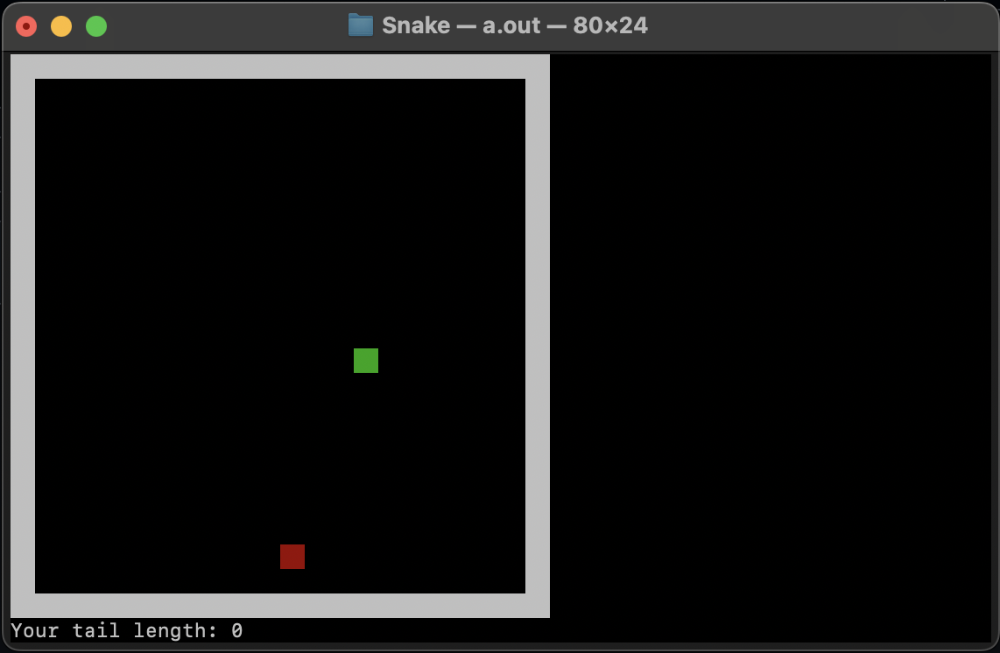
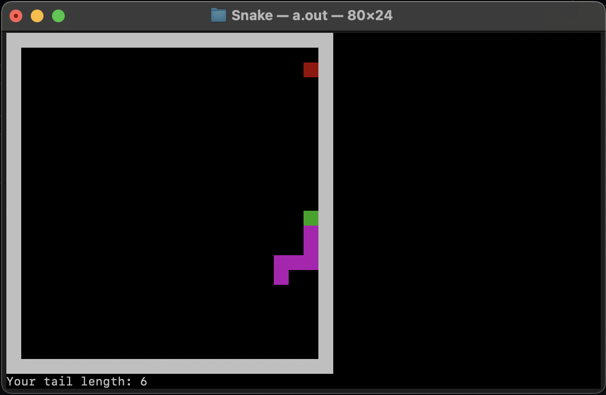
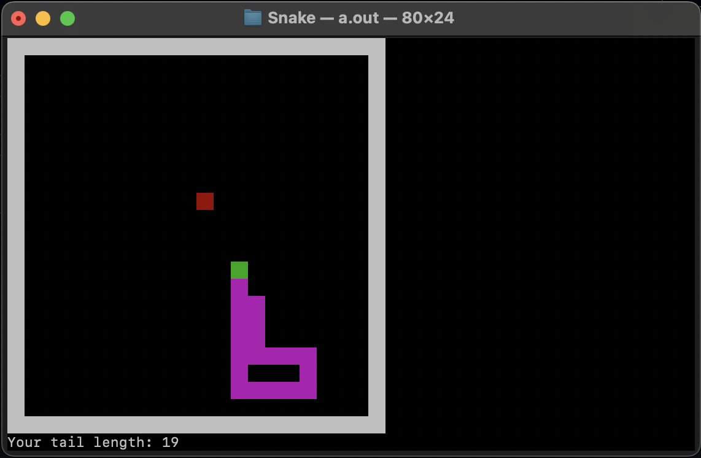
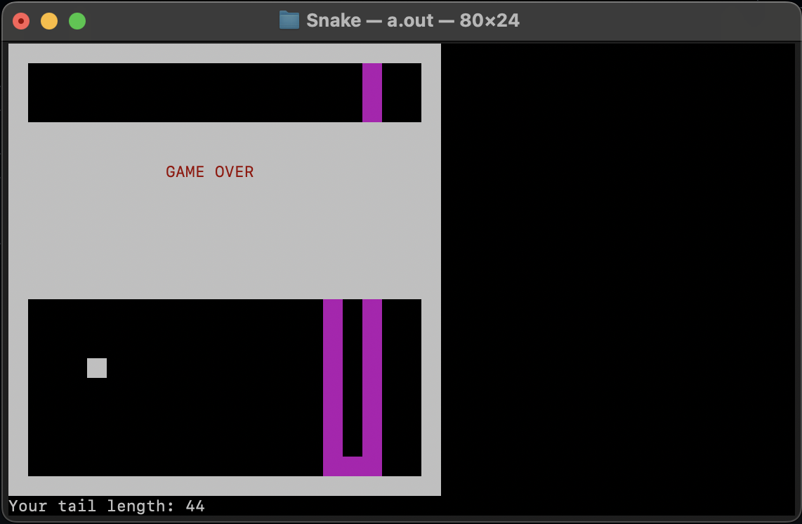

# Snake for MacOS
This is a traditional Snake game created to intergrate with MacOS. The game runs in the terminal and uses the Linux library called ncurses. 
## Instalation
First, you need to install ncurses library:
```bash 
brew install ncurses
```
Then, navigate to the directory where you want to download Snake and open it using the command cd and use following commands: 
```bash 
git clone https://github.com/GaThsaPer/Snake-on-MacOS.git
cd Snake-on-MacOS
```
If you don't want unnecessary files, run the following commands:
```bash
rm ./.gitignore
rm -rf ./.git
rm -rf ./Images
```
Then, to compile files, run:
```bash
g++ -std=c++17 -o Snake main.cpp Snake_MacOS.cpp -lncurses
```
If you don't have a g++ compiler, you need to install GCC (GNU Compiler Collection):
```bash
brew install gcc
```
Then you can then play by double-clicking the created file or by typing the following in the terminal: 
```bash
./Snake
```
## Visualization
 
 
